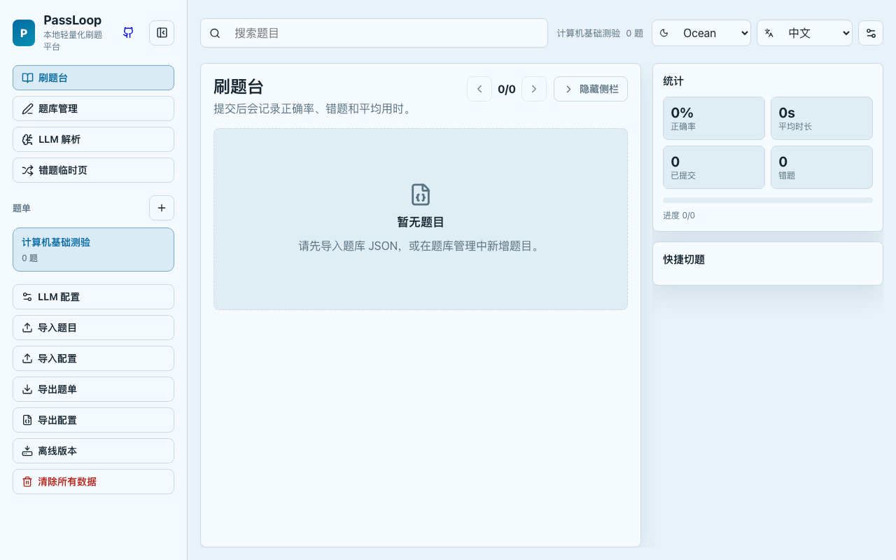

# PassLoop

[English](docs/README.en.md) | [日本語](docs/README.ja.md) | [한국어](docs/README.ko.md) | [Français](docs/README.fr.md)

本地轻量化刷题平台。支持题目导入导出、多种练习模式、LLM 辅助解析、错题管理和答题统计。所有数据存储在浏览器 localStorage 中，无需后端服务，开箱即用。

## 截图预览




## 功能特性

### 刷题练习
- **刷题模式**：逐题作答，提交后显示对错与解析
- **背题模式**：直接展示正确答案与解析，辅助记忆
- **单题 / 整卷**：逐题浏览或整卷一次性提交
- **答案揭示**：支持即时揭示或答完再揭示两种策略
- **答后自动下一题**：可选的快速刷题节奏
- **题目搜索与筛选**：按标题、题干、题型快速定位
- **快捷导航网格**：可视化题号面板，颜色标记作答状态
- **完成统计弹窗**：答完全部题目后汇总正确率与用时

### 题型支持
- 单选题、多选题、判断题、填空题、简答题

### 题库管理
- 手动新增、编辑、删除题目
- JSON 格式导入导出（本地文件或从 URL 导入，下载时有加载动画）
- 题单创建、编辑、删除
- 全量备份与恢复（合并或覆盖模式）
- 浮动编辑面板，小屏设备也能方便管理题目

### LLM 辅助
- 接入 OpenAI / Anthropic / Gemini 或自定义兼容接口
- CORS 代理支持，解决跨域问题
- 粘贴或上传未格式化文本，一键解析为标准题库 JSON
- 自动补充答案与解析（支持流式预览）
- 连接测试与模型列表拉取
- 自填模式：手动粘贴外部 AI 生成的 JSON 并验证导入

### 错题管理
- 自动收录错误记录
- 练习过程中可生成或导出错题题单继续复习
- 错题导出为独立题单
- 会话计时与实时统计

### 答题统计
- 正确率、平均用时
- 提交进度追踪
- 按题目维度统计
- 错题数量统计

### 个性化与响应式
- 7 个主题：Mint、Paper、Lavender、Ocean、Rose、Night、Nord
- 5 种语言：中文、English、日本語、한국어、Français
- 响应式布局，适配桌面与移动端
- 移动端底部导航栏与浮动面板
- 侧边栏可折叠

## 技术栈

| 类别 | 技术 |
|------|------|
| 框架 | React 18 |
| 语言 | TypeScript |
| 构建 | Vite 7 |
| 图标 | Lucide React |
| 存储 | localStorage |
| 部署 | 纯静态文件，任意 Web 服务器 |

## 快速开始

### 直接使用（无需安装）

从 [Releases](https://github.com/yjh8144/passloop/releases) 下载 `passloop.html`，双击用浏览器打开即可使用。所有功能集成在这一个文件中，无需服务器、无需安装。

### 本地开发

环境要求：Node.js >= 18、npm >= 9

```bash
# 克隆项目
git clone https://github.com/yjh8144/passloop.git
cd passloop

# 安装依赖
npm install

# 启动开发服务器
npm run dev
```

开发服务器默认监听 `http://localhost:5173`，支持局域网访问。

### 代码检查与格式化

```bash
npm run lint      # ESLint 检查
npm run format    # Prettier 格式化
```

### 构建生产版本

```bash
npm run build          # 常规构建，输出到 dist/
npm run build:single   # 单文件构建，输出 dist-single/index.html
```

产物输出到 `dist/` 目录。单文件版本输出到 `dist-single/index.html`，可直接用浏览器打开。

### 本地预览生产版本

```bash
npm run preview
```

## 部署

PassLoop 构建产物为纯静态文件（HTML + CSS + JS），可部署到任何静态托管服务（Vercel、Netlify、GitHub Pages、Cloudflare Pages 等），也可使用 Nginx 或 Docker 自行托管。

构建命令：`npm run build`，输出目录：`dist`。

## CORS 代理

LLM API 存在跨域限制，项目在 `proxy/` 目录提供两种可选代理方案：

- **Cloudflare Workers** — 无服务器，免费额度
- **Node.js** — 自有 VPS 部署，支持 Docker

详见 [proxy/README.md](proxy/README.md)。

## 数据说明

所有用户数据存储在浏览器 localStorage 中：

| Key | 内容 |
|-----|------|
| `passloop.app.v1` | 题库、题单、答题记录、设置 |
| `passloop.llm-config.v2` | LLM 提供商配置（不包含 API Key） |
| `passloop.proxy.v1` | CORS 代理配置（不包含代理密钥） |
| `passloop.debug` | 调试模式开关 |

清除浏览器数据会导致所有题目和记录丢失，建议定期使用「导出备份」功能保存数据。

## 许可证

MIT
